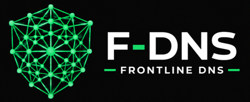

# Cover Page

Team Members: Cole Amacker, Tim Heiser, Veronica Rine, 
James Yoho, Isaiah Zimmerman

September 24th, 2026

## Introduction

### Purpose of the System

The military controls numerous devices connected to closed networks. Since they are on closed networks, users use outdated methods to map IPs to device names and track IP address ranges on applications not designed for DNS, such as Microsoft Excel. The purpose of this system is to upgrade their network management tools through a gradual migration.

### Target Users

The target users are TurbineOne employees who are setting up IT systems in various locations and military personnel who are collaborating with the TurbineOne employees.

### Main Features

The main features are DNS functionality, an admin dashboard, and device health check capabilities. The DNS functionality will allow users to track IPv4s, IPv6s, and domain names through a dedicated application, and allow for importing and exporting to and from Excel to ease the software migration. The admin dashboard enables management of importing and exporting from Excel, user management, and review and editing of device adding requests submitted by users. The device health check capabilities let admins track network status and review logs of previously documented issues.

## Representative Tasks

### 1: Health Checks - Unsolved Failure
Matt, a senior field engineer at T1, is monitoring the health of a military base's network hosted on f-dns. When he checks on the network status, he immediately sees that a high value server is down on the network. Matt immediately sends a ping to the server to try and diagnose the problem, and recieves no response. He knows there are engineers assigned to maintain this device, and pulls up the metadata of the server to check who is responsible.

In the metadata, he sees that the server has been down for more than 15 minutes, and that Tim and Cole are the engineers assigned to this part of the network. According to the metadata, Tim has been alerted, but neither employee has responded. Matt immediately sends an alert to both engineers. Cole acknowledges the alert and begins working on diagnosing and fixing the issue.

### 2: Health Checks - Diagnosing and Fixing
James, a field engineer onsite at a military base, receives a notification by text that a datacenter on the network he is assigned to is down. He quickly pings the server, and is able to diagnose the issue. After resetting the datacenter, the metadata is updated, recording the downtime, as well as James' ping request, diagnosis, and reset of the server.

### 3: Health Checks - Analyzing Uptime
Matt has had some concerns about the uptime of the datacenter that James just fixed in the previous task. He pulls up the metadata of the datacenter to look at its statistics, seeing the recent outage, as well as James' fix. Included in the metadata is an uptime report, showing that the datacenter has only been able to maintain about 90% uptime, which is much lower than expected. Matt is then able to use this data to assess if the datacenter needs to be replaced or updated.

### 4: Health Checks - Topology Analysis
Tim is a senior field engineer in charge of a large military base network, who recieves notifications for a large part of the network going down suddenly. To diagnose what might be causing a problem for such a large chunk of the network, he pulls up the automatically generated topology map for the network.

After pulling up the topology map, Tim notices that all the devices that are down are part of one subnetwork, all routing through a single router that is also down. Tim sends a ping to this router, and gets no response, realizing that this is the likely failure point. Tim then checks the metadata to see what engineers are responsible for this part of the network. He sends notifications to James and Veronica, and they rush to diagnose and fix the issue.

## Related Work

### Product 1 - SolarWinds
SolarWinds [1] is an IP address manager that provides much of the same functionality we are looking to build in our own product. SolarWinds is designed as a modern alternative to keeping IP and DNS information in spreadsheets that can become difficult to manage at larger scales. It provides a user interface that allows network administrators to look at available IP addresses and monitor the status and usage of active addresses. Additionally, SolarWinds actively scans networks in order to perform health checks and record various pieces of metadata about network devices. 

Although the features listed above are very similar to the features we plan on building into our product, the foundational aspect of our product is a DNS server, whereas SolarWinds is an IP address manager. Because of this, SolarWinds offers a wider range of features than TurbineOne needs, and the extensive software suite comes with a high price tag, which is overkill for our specific use case. Additionally, since TurbineOne works with DoD customers, there are more stringent requirements for software, and a smaller, locally hosted piece of software will offer more flexibility.

### Product 2 - Infoblox DDI
Infoblox [2] aligns almost exactly with our product's goal, but it once again has a wider scope and more robust set of features than TurbineOne needs. Infoblox's service includes the management of DNS, DHCP, and IP addresses. Infoblox emphasizes its ability to manage networks that are transitioning from IPv4 to IPv6, which is one of the goals of our product as well.

Although the software Infoblox creates has largely the same purpose as the product we want to build, the scale, deployment footprint, and operational overhead of the two products differ significantly. TurbineOne is a quickly growing company that works with a variety of military customers, and its need is for a piece of software that can be quickly deployed in a variety of locations (we will aim to do this by having our product deployable through a Docker container). Infoblox is an industry leader in network management, but its product is bulky and expensive. Our goal is to create a product that is streamlined to a narrower set of needs and easily deployable in an offline setting. 

### Product 3 - Auvik 
Auvik [3] is a network monitoring platform that focuses on the live state of the network instead of managing IP addresses and DNS servers. Our product will be considerably different from Auvik because we are primarily interested in providing TurbineOne with an easily managed DNS server and network monitoring capabilities. However, Auvik does put a significant focus on network topology maps that allow users to see the network layout, network links, and the paths that network traffic flows through. This feature is not included in our MVP, but it is something that we hope to implement in some form after completing other basic aspects of our product. Because different devices in TurbineOne's networks will be mobile, we hope that our product will include a tool to visualize how the network links change as devices move. 

### Product 4 - CoreDNS
CoreDNS [4] is a lightweight Go-based DNS server. The software is modularized into plugins, so users can choose different plugins based on individual use cases, which keeps CPU usage low. CoreDNS is open source and containerized, so it can be easily deployed with minimal setup time. Our product will strive to be similar to CoreDNS, but with a few added features such as an administrative dashboard and network monitoring. The architecture of our product is especially similar to CoreDNS because our software will be written in Go and deployable in a Docker container. 

## Bibliography
[1] SolarWinds Worldwide, LLC, "IP Address Manager (IPAM)," SolarWinds. Available: https://www.solarwinds.com/ip-address-manager/. [Accessed: Sep. 24, 2026].

[2] Infoblox, "DDI Solutions: DNS, DHCP, and IP Address Management," Infoblox. Available: https://www.infoblox.com/solutions/. [Accessed: Sep. 24, 2026].

[3] Auvik Networks Inc., "Automated Network Mapping Software," Auvik. Available: https://www.auvik.com/network-management-software/network-mapping-software/. [Accessed: Sep. 24, 2026].

[4] CoreDNS Authors, "CoreDNS: DNS and Service Discovery," CoreDNS. Available: https://coredns.io/. [Accessed: Sep. 24, 2026].